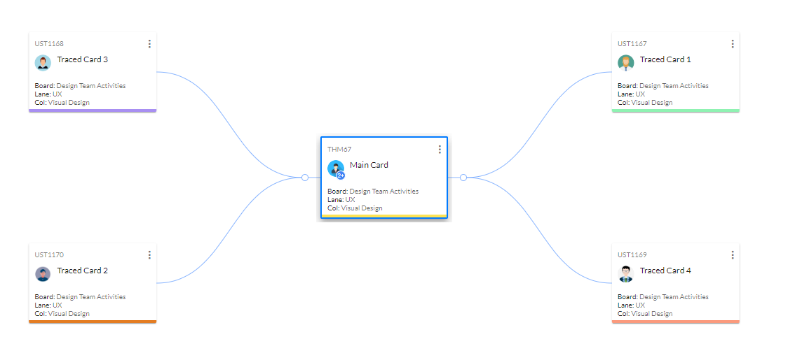

react-traceability
=========================
## Installation
```bash
npm install --save react-traceability
```
## Usage

This is the minimal required configuration.
```javascript
import TraceView from "react-traceability"; 

class App extends Component {
  render() {
      const traceConfig = {
        data: {
            "name": "Root",
            "children": [{
                "name": "Branch 1"
            },
            {
                "name": "Branch 2"
            }]
        },
        nodeWidth: 182,
        nodeHeight: 77
    };
    return (
      <TraceView traceConfig={ traceConfig } node={ #component#" }/>
    );
  }
}
```

## Advanced Usage
```bash
# Node props can be passed by using nodeConfig
# All the props provided in nodeConfig will be passed to node
<TraceView traceConfig={ traceConfig } node={ #component#" } nodeConfig={{
	cardConfig: {},
	zoom: 3
}} />

# Config on root node
# This paddings will be applied in root node foreign object
const rootNodeConfig = {
	padding: {
		top: 4,
		bottom: 4,
		left: 4,
		right: 4
	}
}

<TraceView rootNode={ rootNodeConfig } />

```
## Tests
```bash
# Make sure that you've installed the dependencies
npm install
# Run tests
npm test
```
## sample

